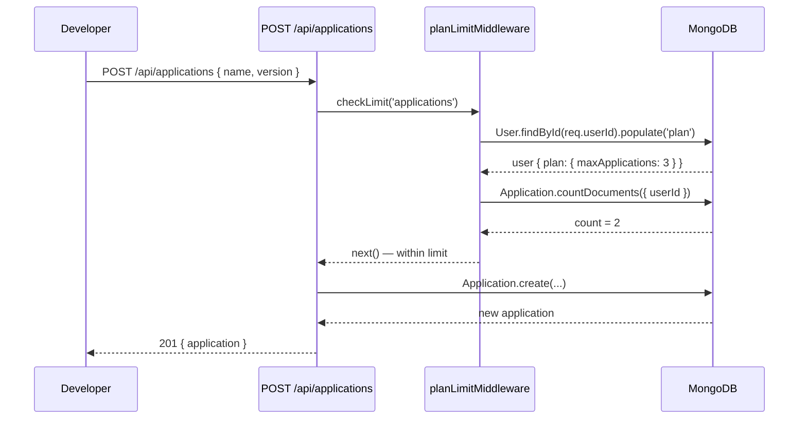
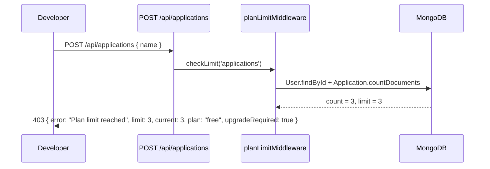
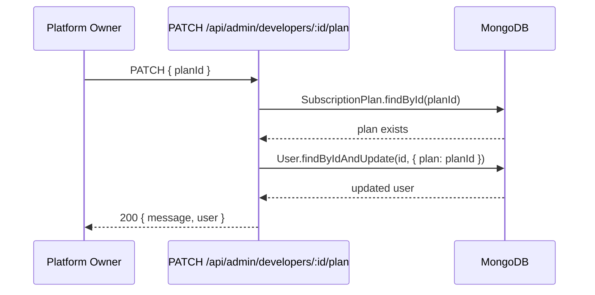

# Design Document: Subscription Plans

## Overview

This feature adds tiered subscription plans (Free, Pro, Enterprise) to the platform so that developers who register and use the auth SaaS are placed on a plan that governs how many applications, users per application, and licenses they can create. The platform owner (admin) can view plan distribution across all developers and manually assign or change plans. The system is designed to be monetization-ready but does not require a payment processor in the initial implementation.

The feature integrates directly into the existing `User` model and enforces limits at the API layer whenever a developer attempts to create a resource (application, license, app-user). A new `SubscriptionPlan` model stores plan definitions, and a lightweight middleware function checks limits before any resource-creation route proceeds.

---

## Architecture

```mermaid
graph TD
    subgraph Frontend [Next.js Frontend]
        DP[Dashboard Page]
        PP[Plan & Billing Page]
        AP[Admin: Developers Page]
    end

    subgraph Backend [Express Backend]
        PR[/api/plans routes]
        AR[/api/applications routes]
        LR[/api/licenses routes]
        UR[/api/users routes]
        ADM[/api/admin routes]
        PLM[planLimitMiddleware]
        PM[Plan Model]
        UM[User Model - plan field]
    end

    subgraph DB [MongoDB]
        Plans[(subscription_plans)]
        Users[(users)]
        Apps[(applications)]
        Licenses[(licenses)]
        AppUsers[(appusers)]
    end

    DP --> AR
    PP --> PR
    AP --> ADM
    AR --> PLM
    LR --> PLM
    UR --> PLM
    PLM --> PM
    PLM --> UM
    PM --> Plans
    UM --> Users
    AR --> Apps
    LR --> Licenses
    UR --> AppUsers
    ADM --> PR
    ADM --> UM
```

---

## Sequence Diagrams

### Developer Creates an Application (Limit Check)



### Developer Hits Plan Limit



### Admin Changes Developer Plan



---

## Components and Interfaces

### Component 1: SubscriptionPlan Model

**Purpose**: Stores plan definitions with their resource limits. Plans are stored in the database so the admin can adjust limits without a code deploy.

**Interface**:
```typescript
interface ISubscriptionPlan {
  _id: ObjectId
  name: 'free' | 'pro' | 'enterprise'
  displayName: string          // "Free", "Pro", "Enterprise"
  price: number                // monthly price in USD cents (0 for free)
  limits: {
    maxApplications: number    // max apps a developer can create (-1 = unlimited)
    maxUsersPerApp: number     // max AppUsers per application (-1 = unlimited)
    maxLicensesPerApp: number  // max Licenses per application (-1 = unlimited)
    maxApiCallsPerDay: number  // rate limit bucket per day (-1 = unlimited)
  }
  features: string[]           // human-readable feature list for UI display
  isActive: boolean
  createdAt: Date
  updatedAt: Date
}
```

**Responsibilities**:
- Serve as the source of truth for what each plan allows
- Seed default Free/Pro/Enterprise plans on first startup
- Allow admin to update limits without touching code

---

### Component 2: Plan Limit Middleware

**Purpose**: Reusable middleware factory that checks whether a developer has reached their plan limit before allowing resource creation.

**Interface**:
```typescript
type ResourceType = 'applications' | 'usersPerApp' | 'licensesPerApp'

function checkPlanLimit(resource: ResourceType): RequestHandler
```

**Responsibilities**:
- Load the developer's current plan (with Redis caching)
- Count existing resources for the developer
- Return `403` with a structured error if limit is reached
- Call `next()` if within limits
- Cache plan data in Redis with a short TTL to avoid per-request DB hits

---

### Component 3: Plan Routes (`/api/plans`)

**Purpose**: Exposes plan information to authenticated developers and plan management to the admin.

**Responsibilities**:
- `GET /api/plans` — public list of all active plans (for pricing page)
- `GET /api/plans/my` — authenticated developer's current plan + usage summary
- `PATCH /api/admin/developers/:id/plan` — admin assigns a plan to a developer
- `PUT /api/admin/plans/:id` — admin updates plan limits

---

### Component 4: User Model Extension

**Purpose**: Add a `plan` reference and `planAssignedAt` timestamp to the existing `User` document.

**Interface** (additions to existing schema):
```typescript
interface IUserPlanExtension {
  plan: ObjectId | ISubscriptionPlan  // ref: 'SubscriptionPlan', default: free plan _id
  planAssignedAt: Date
}
```

---

### Component 5: Frontend Plan & Billing Page

**Purpose**: Lets developers see their current plan, usage against limits, and available upgrade options.

**Responsibilities**:
- Display current plan name and limits
- Show live usage bars (e.g., "2 / 3 applications used")
- List available plans with feature comparison
- Show "Contact us to upgrade" CTA (no payment flow in v1)

---

## Data Models

### SubscriptionPlan Schema

```typescript
const subscriptionPlanSchema = new Schema({
  name: {
    type: String,
    enum: ['free', 'pro', 'enterprise'],
    required: true,
    unique: true
  },
  displayName: { type: String, required: true },
  price: { type: Number, default: 0 },          // USD cents/month
  limits: {
    maxApplications:   { type: Number, default: 3 },
    maxUsersPerApp:    { type: Number, default: 100 },
    maxLicensesPerApp: { type: Number, default: 50 },
    maxApiCallsPerDay: { type: Number, default: 1000 }
  },
  features: [{ type: String }],
  isActive: { type: Boolean, default: true }
}, { timestamps: true })
```

### Default Plan Tiers

| Limit | Free | Pro | Enterprise |
|---|---|---|---|
| Max Applications | 3 | 10 | -1 (unlimited) |
| Max Users per App | 100 | 1,000 | -1 (unlimited) |
| Max Licenses per App | 50 | 500 | -1 (unlimited) |
| Max API Calls/Day | 1,000 | 10,000 | -1 (unlimited) |
| Price (USD/month) | $0 | $19 | $99 |

### User Schema Additions

```typescript
// Added to existing userSchema
plan: {
  type: mongoose.Schema.Types.ObjectId,
  ref: 'SubscriptionPlan',
  default: null   // resolved to 'free' plan _id during seeding
},
planAssignedAt: {
  type: Date,
  default: Date.now
}
```

**Validation Rules**:
- `plan` must reference a valid, active `SubscriptionPlan` document
- When a user registers, they are automatically assigned the `free` plan
- Plan downgrades do not delete existing resources but block new creation once over the new limit

---

## API Endpoints

### Public / Developer Endpoints

| Method | Path | Auth | Description |
|---|---|---|---|
| `GET` | `/api/plans` | None | List all active plans (pricing page) |
| `GET` | `/api/plans/my` | `verifyToken` | Current developer's plan + usage |

### Admin Endpoints (existing `/api/admin` router, `verifyOwner`)

| Method | Path | Auth | Description |
|---|---|---|---|
| `GET` | `/api/admin/plans` | Owner | List all plans with developer counts |
| `PUT` | `/api/admin/plans/:id` | Owner | Update plan limits |
| `PATCH` | `/api/admin/developers/:id/plan` | Owner | Assign plan to a developer |
| `GET` | `/api/admin/developers` | Owner | Extended to include plan info (existing route updated) |

### Request / Response Shapes

**`GET /api/plans/my`** response:
```json
{
  "plan": {
    "name": "free",
    "displayName": "Free",
    "limits": {
      "maxApplications": 3,
      "maxUsersPerApp": 100,
      "maxLicensesPerApp": 50,
      "maxApiCallsPerDay": 1000
    },
    "features": ["3 applications", "100 users/app", "50 licenses/app"]
  },
  "usage": {
    "applications": { "current": 2, "limit": 3 },
    "totalUsers": { "current": 45, "limit": null },
    "totalLicenses": { "current": 12, "limit": null }
  }
}
```

**`403` limit-reached response** (from middleware):
```json
{
  "error": "Plan limit reached",
  "resource": "applications",
  "current": 3,
  "limit": 3,
  "plan": "free",
  "upgradeRequired": true
}
```

**`PATCH /api/admin/developers/:id/plan`** request:
```json
{ "planId": "<ObjectId of target plan>" }
```

---

## Key Functions with Formal Specifications

### `checkPlanLimit(resource)` — Middleware Factory

```javascript
function checkPlanLimit(resource) {
  return async (req, res, next) => { ... }
}
```

**Preconditions:**
- `req.userId` is set (i.e., `verifyToken` has already run)
- `resource` is one of `'applications'`, `'usersPerApp'`, `'licensesPerApp'`
- For `'usersPerApp'` and `'licensesPerApp'`, `req.params.id` contains the application `_id`

**Postconditions:**
- If `limit === -1`: always calls `next()`
- If `current < limit`: calls `next()`
- If `current >= limit`: returns `403` with structured error body; does NOT call `next()`
- Does not mutate any database documents

**Loop Invariants:** N/A (no loops)

---

### `seedPlans()` — Startup Seeder

```javascript
async function seedPlans() { ... }
```

**Preconditions:**
- MongoDB connection is established
- `SubscriptionPlan` model is registered

**Postconditions:**
- Exactly three plan documents exist: `free`, `pro`, `enterprise`
- Existing plans are not overwritten (uses `upsert` with `setOnInsert`)
- All newly registered users without a plan are assigned the `free` plan `_id`

---

### `getUserPlanWithUsage(userId)` — Service Function

```javascript
async function getUserPlanWithUsage(userId) { ... }
```

**Preconditions:**
- `userId` is a valid MongoDB `ObjectId`
- User document exists in the database

**Postconditions:**
- Returns `{ plan, usage }` object
- `plan` is the populated `SubscriptionPlan` document
- `usage.applications.current` equals `Application.countDocuments({ userId })`
- Result is cached in Redis under key `plan:usage:{userId}` with TTL of 60 seconds

---

## Algorithmic Pseudocode

### Plan Limit Check Algorithm

```pascal
PROCEDURE checkPlanLimit(resource, req, res, next)
  INPUT: resource ∈ { 'applications', 'usersPerApp', 'licensesPerApp' }
  OUTPUT: calls next() OR sends 403 response

  SEQUENCE
    // 1. Load user with plan (try Redis cache first)
    cacheKey ← 'plan:' + req.userId
    cached ← redis.get(cacheKey)

    IF cached IS NOT NULL THEN
      plan ← JSON.parse(cached)
    ELSE
      user ← User.findById(req.userId).populate('plan')
      IF user.plan IS NULL THEN
        plan ← SubscriptionPlan.findOne({ name: 'free' })
      ELSE
        plan ← user.plan
      END IF
      redis.setex(cacheKey, 60, JSON.stringify(plan))
    END IF

    // 2. Determine limit for this resource
    IF resource = 'applications' THEN
      limit ← plan.limits.maxApplications
      current ← Application.countDocuments({ userId: req.userId })
    ELSE IF resource = 'usersPerApp' THEN
      limit ← plan.limits.maxUsersPerApp
      current ← AppUser.countDocuments({ applicationId: req.params.id })
    ELSE IF resource = 'licensesPerApp' THEN
      limit ← plan.limits.maxLicensesPerApp
      current ← License.countDocuments({ applicationId: req.params.id })
    END IF

    // 3. Enforce limit
    IF limit = -1 THEN
      CALL next()
      RETURN
    END IF

    IF current >= limit THEN
      RETURN res.status(403).json({
        error: 'Plan limit reached',
        resource: resource,
        current: current,
        limit: limit,
        plan: plan.name,
        upgradeRequired: true
      })
    ELSE
      CALL next()
    END IF
  END SEQUENCE
END PROCEDURE
```

### Plan Seeding Algorithm

```pascal
PROCEDURE seedPlans()
  INPUT: none
  OUTPUT: ensures Free, Pro, Enterprise plans exist in DB

  SEQUENCE
    defaultPlans ← [
      { name: 'free',       displayName: 'Free',       price: 0,    limits: { maxApplications: 3,  maxUsersPerApp: 100,  maxLicensesPerApp: 50,  maxApiCallsPerDay: 1000  } },
      { name: 'pro',        displayName: 'Pro',        price: 1900, limits: { maxApplications: 10, maxUsersPerApp: 1000, maxLicensesPerApp: 500, maxApiCallsPerDay: 10000 } },
      { name: 'enterprise', displayName: 'Enterprise', price: 9900, limits: { maxApplications: -1, maxUsersPerApp: -1,   maxLicensesPerApp: -1,  maxApiCallsPerDay: -1    } }
    ]

    FOR each planData IN defaultPlans DO
      SubscriptionPlan.findOneAndUpdate(
        { name: planData.name },
        { $setOnInsert: planData },
        { upsert: true, new: true }
      )
    END FOR

    freePlan ← SubscriptionPlan.findOne({ name: 'free' })

    // Backfill existing users who have no plan assigned
    User.updateMany(
      { plan: null },
      { $set: { plan: freePlan._id, planAssignedAt: Date.now() } }
    )
  END SEQUENCE
END PROCEDURE
```

---

## Error Handling

### Error Scenario 1: Plan Not Found

**Condition**: User's `plan` field is `null` or references a deleted plan document.
**Response**: Middleware falls back to the `free` plan limits rather than throwing an error. This prevents a broken plan reference from locking a developer out.
**Recovery**: Admin can re-assign a valid plan via `PATCH /api/admin/developers/:id/plan`.

### Error Scenario 2: Limit Reached

**Condition**: Developer attempts to create a resource that would exceed their plan's limit.
**Response**: `403 { error: "Plan limit reached", upgradeRequired: true, ... }`. The frontend displays an upgrade prompt.
**Recovery**: Admin assigns a higher plan; developer retries the operation.

### Error Scenario 3: Invalid Plan Assignment

**Condition**: Admin sends a `planId` that does not exist or belongs to an inactive plan.
**Response**: `404 { error: "Plan not found or inactive" }`.
**Recovery**: Admin uses `GET /api/admin/plans` to retrieve valid plan IDs.

### Error Scenario 4: Redis Cache Miss / Redis Down

**Condition**: Redis is unavailable when middleware tries to read cached plan data.
**Response**: Middleware falls back to a direct MongoDB query. No error is surfaced to the developer.
**Recovery**: Automatic — once Redis recovers, caching resumes on the next request.

---

## Testing Strategy

### Unit Testing Approach

- Test `checkPlanLimit` middleware in isolation by mocking `User.findById`, `Application.countDocuments`, and the Redis client.
- Test `seedPlans()` with an in-memory MongoDB instance to verify upsert behavior and backfill logic.
- Test `getUserPlanWithUsage()` to verify correct aggregation of usage counts.

Key test cases:
- Limit `-1` always calls `next()`
- `current < limit` calls `next()`
- `current === limit` returns `403`
- `current > limit` (edge case after plan downgrade) returns `403`
- Missing plan falls back to `free` plan limits

### Property-Based Testing Approach

**Property Test Library**: `fast-check`

Properties to verify:
- For any `current ∈ [0, limit)`, middleware always calls `next()`
- For any `current ≥ limit` where `limit > 0`, middleware always returns `403`
- For `limit = -1`, middleware always calls `next()` regardless of `current`
- Plan seeding is idempotent: running `seedPlans()` N times produces the same 3 plan documents

### Integration Testing Approach

- Test the full flow: register developer → auto-assigned free plan → create 3 apps → 4th app returns `403`
- Test admin plan assignment: assign `pro` plan → developer can now create up to 10 apps
- Test `GET /api/plans/my` returns accurate live usage counts

---

## Performance Considerations

- Plan data is cached in Redis per user with a 60-second TTL. This means limit checks add ~1ms overhead (Redis round-trip) rather than a full MongoDB query on every request.
- Usage counts (`countDocuments`) use indexed fields (`userId`, `applicationId`) so they remain fast even at scale.
- The `plan` field on `User` is populated via a single `populate()` call — no N+1 queries.
- For the admin developers list, plan info is joined in a single aggregation pipeline rather than per-user queries.

---

## Security Considerations

- Plan assignment (`PATCH /api/admin/developers/:id/plan`) is protected by both `verifyToken` and `verifyOwner` middleware — only the platform owner can change plans.
- Developers cannot self-assign plans; the `plan` field is never accepted in user-facing update endpoints.
- The `403` limit response does not expose internal system details beyond what is needed for the upgrade prompt.
- Plan limits are enforced server-side; the frontend usage display is informational only and cannot be bypassed.

---

## Dependencies

- **Existing**: `mongoose`, `redis` (already in use — no new packages required)
- **New**: None — the feature is implemented entirely with existing stack dependencies
- **Frontend**: No new npm packages; uses existing `fetch`/`api.ts` patterns and Tailwind CSS components


---

## Correctness Properties

*A property is a characteristic or behavior that should hold true across all valid executions of a system — essentially, a formal statement about what the system should do. Properties serve as the bridge between human-readable specifications and machine-verifiable correctness guarantees.*

### Property 1: Unlimited limit always passes

*For any* developer, any resource type, and any current usage value, when the plan's limit for that resource is `-1`, the Plan_Limit_Middleware SHALL call `next()` and never return a 403 response.

**Validates: Requirements 1.4, 4.1**

---

### Property 2: Limit enforcement correctness

*For any* developer with a plan limit `L > 0` for a given resource, and any current usage value `C`:
- If `C < L`, the Plan_Limit_Middleware SHALL call `next()`
- If `C >= L`, the Plan_Limit_Middleware SHALL return HTTP 403 with a body containing exactly the fields: `error`, `resource`, `current`, `limit`, `plan`, and `upgradeRequired: true`

**Validates: Requirements 4.2, 4.3, 4.4, 11.4**

---

### Property 3: Middleware is read-only

*For any* limit check invocation (whether it passes or blocks), the Plan_Limit_Middleware SHALL NOT modify any document in the `users`, `applications`, `licenses`, or `appusers` collections.

**Validates: Requirements 4.4**

---

### Property 4: Plan seeder idempotence

*For any* number of times `seedPlans()` is called (N ≥ 1), the resulting state of the `subscription_plans` collection SHALL always be exactly three documents with names `free`, `pro`, and `enterprise`, with the same field values as after the first run.

**Validates: Requirements 2.1, 2.2**

---

### Property 5: New user free plan assignment

*For any* valid developer registration payload, the resulting User document SHALL have its `plan` field set to the Free_Plan `_id` and `planAssignedAt` set to a non-null timestamp.

**Validates: Requirements 3.2**

---

### Property 6: Seeder backfills all plan-less users

*For any* set of User documents with a null `plan` field present before `seedPlans()` runs, after `seedPlans()` completes, every one of those User documents SHALL have its `plan` field set to the Free_Plan `_id`.

**Validates: Requirements 2.6**

---

### Property 7: Usage counts are accurate

*For any* developer with any number of Application documents, `getUserPlanWithUsage(userId)` SHALL return `usage.applications.current` equal to `Application.countDocuments({ userId })` and `usage.applications.limit` equal to the plan's `maxApplications` value.

**Validates: Requirements 5.1, 5.2, 5.3**

---

### Property 8: Plan field is immutable via developer endpoints

*For any* developer update request payload that includes a `plan` field with any value, the developer's `plan` field in the database SHALL remain unchanged after the request is processed.

**Validates: Requirements 3.4, 11.2**

---

### Property 9: Admin endpoints reject non-admin users

*For any* authenticated non-admin user and any request to any `/api/admin/` endpoint, THE System SHALL return HTTP 403 regardless of the request body or parameters.

**Validates: Requirements 7.5, 11.1**

---

### Property 10: Plan downgrade preserves existing resources

*For any* developer with any number of existing Resource documents, after the developer's plan is changed to a lower tier, the count of Resource documents for that developer SHALL remain unchanged.

**Validates: Requirements 8.1**

---

### Property 11: GET /api/plans returns all active plans

*For any* state of the `subscription_plans` collection, `GET /api/plans` SHALL return a response containing exactly the set of SubscriptionPlan documents where `isActive` is `true`, with no omissions or additions.

**Validates: Requirements 6.1**

---

### Property 12: Admin developer list includes plan info

*For any* list of developers returned by `GET /api/admin/developers`, every developer object in the response SHALL include a non-null `plan` name and a `planAssignedAt` timestamp.

**Validates: Requirements 7.6, 10.1**

---

### Property 13: SubscriptionPlan documents contain all required fields

*For any* SubscriptionPlan document created or updated in the system, the document SHALL contain all required fields: `name`, `displayName`, `price`, `limits.maxApplications`, `limits.maxUsersPerApp`, `limits.maxLicensesPerApp`, `limits.maxApiCallsPerDay`, `features`, `isActive`, `createdAt`, and `updatedAt`.

**Validates: Requirements 1.2**

---

### Property 14: Frontend usage display reflects API data

*For any* usage data returned by `GET /api/plans/my`, the Plan & Billing page SHALL render usage bars where the displayed `current` and `limit` values exactly match the values in the API response for each resource type.

**Validates: Requirements 9.2, 9.3**

---

### Property 15: Upgrade prompt shown on any 403 limit response

*For any* HTTP 403 response with `upgradeRequired: true` received from any resource-creation endpoint, the Frontend SHALL display an upgrade prompt directing the Developer to the Plan & Billing page.

**Validates: Requirements 9.6**
